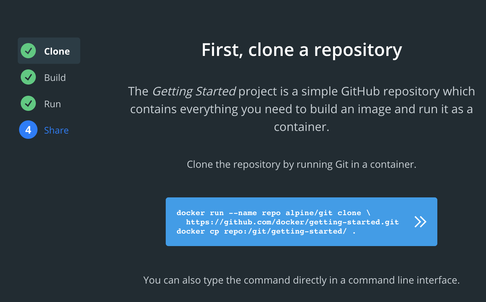
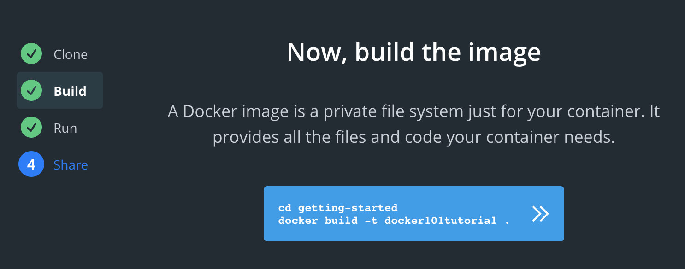
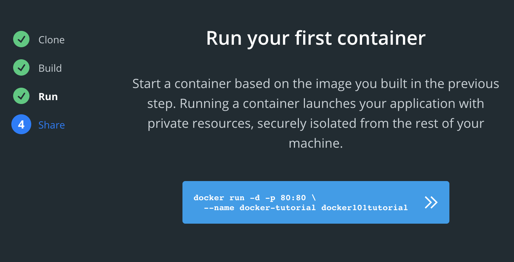
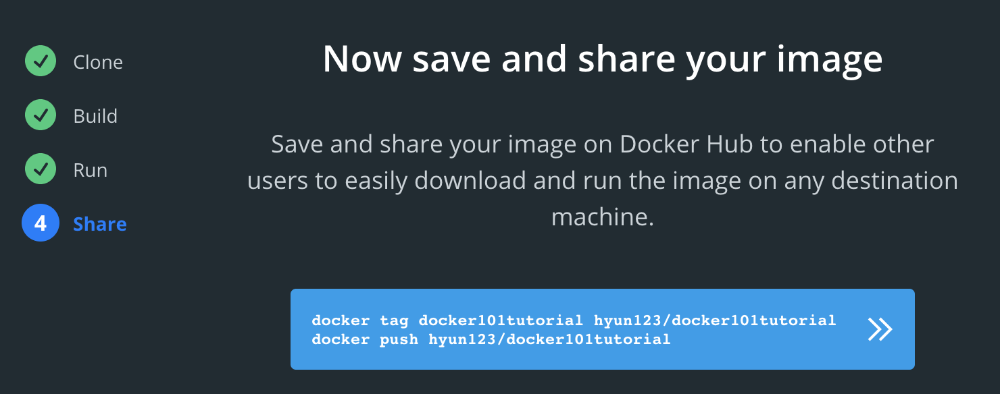

### clone docker repository sample source code
- alpine/git 은 git 명령어를 호출해줌. 그냥 git clone해도됨


### build
- 이미지를 생성(docker101tutorial이라는 이름의 이미지 생성)
- 이미지를 빌드할 소스코드의 위치를 '.' 로 설정
- 버전 설정 : docker build -t hyun123/project:0.1.0 .


### run
- 빌드한 이미지를 docker-tutorial이라는 이름으로 실행


### push repository
- 이미지를 dockerhub에 푸시
- tag명령어로 local의 tag(이미지 이름)과 리모트의 계정의 tag와 맵핑시키는 듯
- AWS ECR등 dockerhub가 아닌 다른 repo로 푸시 가능함 
  ```
  docker tag hyun123/project:latest 1234566.dkr.ecr.ap-south-1.amazonaws.com/hyun/project:latest
  ```


### check repositories here
[repositories](https://hub.docker.com/repositories)


### docker repository 없이 파일로 image사용하기
https://stackoverflow.com/questions/24482822/how-to-share-my-docker-image-without-using-the-docker-hub